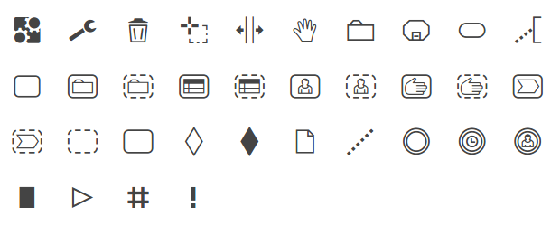

# CMMN Font

A CMMN 1.1 icon font. Use it to model CMMN diagrams in your Word, VIM or other text editor.




Checkout the [demo page](https://rawgit.com/bpmn-io/cmmn-font/master/dist/demo.html) for a list of included icons and their character code.


## Usage in HTML

Include [CSS file](./dist/css/cmmn.css) and [fonts](./dist/font) into your webpage.

Use icons prefixed with `cmmn-icon-`, i.e.:

```
<span class="cmmn-icon-milestone"></span>
```


## License

[SIL](http://scripts.sil.org/cms/scripts/page.php?item_id=OFL_web)
